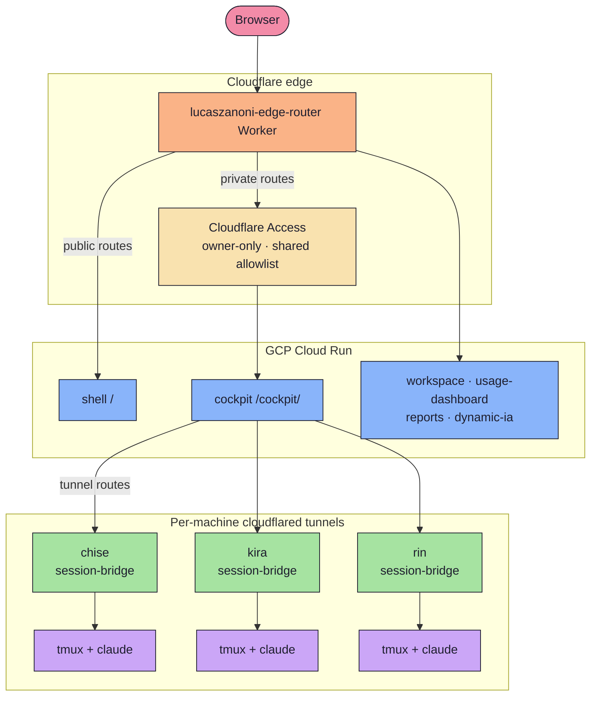

<div align="center">

<h2 align="center"><a href="https://github.com/castrozan" target="_blank" rel="noopener noreferrer">atrium · Zanoni's Personal Platform</a></h2>

<p align="center">
  
</p>

<p align="center">
  <a href="https://github.com/castrozan/lucaszanoni-web/actions/workflows/ci.yml"></a>
  <a href="https://lucaszanoni.com"></a>
  
  
  
  
  
  
  
</p>

</div>

**atrium** is the personal web platform that runs at **[lucaszanoni.com](https://lucaszanoni.com)**. It is a pnpm and Turborepo monorepo of TypeScript and React **micro-frontends**, each one independently deployable to a scale-to-zero GCP Cloud Run service and mounted at its own path prefix or subdomain. A single **Cloudflare edge Worker** sits in front of everything and routes each request to the right origin, with Cloudflare Access gating the owner-only paths. One of those apps is the **cockpit**, an in-browser agent terminal that lists the machines `chise`, `kira`, and `rin` and drives their live tmux and Claude sessions straight over each machine's own Cloudflare tunnel, with no SSH relay in the path.

<details>
<summary>✨ What's inside</summary>

<br>

Seven micro-frontends and five shared packages:

| App | Stack | Does |
| --- | --- | --- |
| **shell** | Vite SPA, react-router | Landing, about, and catalog pages mounted at `/` |
| **cockpit** | Vite SPA, xterm, react-query | In-browser agent terminal, machine list, and AI center |
| **workspace** | React + xterm component | Reusable terminal and machine-management surface |
| **usage-dashboard** | Vite SPA, Chart.js | Token-usage analytics over snapshot data |
| **reports** | Vite SPA | Quality, baseline, and coverage report pages |
| **dynamic-ia-canvas** | Next.js 15, ReactFlow | Visual canvas for AI-generated workflow nodes |
| **dynamic-ia-interfaces** | Next.js 15, @assistant-ui, AI SDK | Generative chat UI that builds React components from prompts |

Shared packages: **design-system** (Radix UI and Tailwind components, theming, CommandPalette, BottomStatusBar, AppShell), **config** (mount-path constants, the micro-frontend route registry, and the `app-registry.json` parser and builder), **usage-insights** (token aggregation, Chart.js formatting, OTel metrics, memory-recall savings), **snapshot-data** (UsageSnapshot, AccountView, and UsageSummary models with their aggregation functions), and **tsconfig** (shared TypeScript presets).

</details>

---

## 🏗️ Architecture

Every request lands on one Cloudflare Worker. The Worker matches a path prefix or subdomain, runs the private paths through Cloudflare Access, and forwards to the right origin: a Cloud Run micro-frontend, a per-machine tunnel, a static GCS bucket, or an external HTTPS origin. The cockpit reaches each machine over that machine's own cloudflared tunnel to its session-bridge, mounted at `/cockpit/kira-session/` and `/cockpit/rin-session/` for kira and rin, and at `/cockpit/jarvis-session/` for chise.



A few details that keep this honest. Cloud Run services trust an edge-shared-secret header, so they only answer the Worker; tunnel origins and external origins do not carry that header. Cloudflare Access uses two audience kinds, owner-only for a single account and shared for a per-audience email allowlist, with optional Google SSO and a 24-hour session. The Worker strips Access session cookies from subdomain requests so each subdomain keeps its own same-origin scope. Retired routes return `410 Gone` instead of pointing at a dead origin.

---

## 📂 Repository Layout

The repo is a pnpm workspace driven by Turborepo, and it splits into three areas.

**`apps/`** holds the micro-frontends listed above. Most are Vite single-page apps; the two `dynamic-ia` apps run on Next.js 15. Each app ships its own Tailwind config and `vite.config.ts`, tests with Vitest, and covers its flows with Playwright. Every app is built and deployed on its own, so the shell at `/` and the cockpit at `/cockpit/` move independently.

**`packages/`** holds the shared code that the apps import: the design system, the routing and registry helpers in `config`, the usage and snapshot analytics packages, and the shared TypeScript presets. `packages/config/src/app-registry.json` is the single source of truth for which apps exist, where they mount, and how they are served. CI and the deploy matrix both read from it, so the registry and the running topology never drift apart.

**`infra/`** holds the Terraform and OpenTofu modules for the Cloudflare edge Worker and Access audiences, the Cloud Run services, and the per-machine Cloudflare Tunnels, with the live state under `infra/environments/production/`. Each piece is flag-gated by a `TF_VAR_enable_*` variable, so individual machine tunnels or static-route groups can be turned on without touching the rest. Alongside these, `.github/workflows/` carries the CI and deploy pipelines and `docs/` carries the maintainer and keyboard-navigation guides.

---

## 🚀 Getting Started

You need Node 22.12 or newer and pnpm, which `corepack` provisions and pins through the root `packageManager` field.

```bash
corepack pnpm install     # install the whole workspace
corepack pnpm dev         # turbo run dev across the apps
corepack pnpm build       # turbo run build
corepack pnpm test        # vitest across packages
corepack pnpm lint        # eslint
corepack pnpm typecheck   # tsc project-wide
```

Run a single app by scoping the task, for example `corepack pnpm --filter cockpit dev`.

Deploys are keyless and driven by the registry. Open a PR and CI validates everything: typecheck, lint, unit tests, the deployment-contract tests for the edge router and deploy-matrix derivation, the cockpit end-to-end run, the Cloudflare module tests under OpenTofu, and the full build. Merge to `main` and two workflows take over. `deploy-apps` builds each micro-frontend as a Docker image, pushes it to GCP Artifact Registry, and rolls Cloud Run forward with a health-gated traffic migration that only shifts all traffic once the candidate revision answers `200` on `/livez`. `deploy-infrastructure` runs `terraform apply` for the edge, Cloud Run, and tunnels. The deploy matrix derives straight from `app-registry.json`, GCP auth uses workload identity federation, and every secret is injected at runtime from GitHub Actions, never committed. Every service runs scale-to-zero, so the idle platform carries no standing compute cost; `infra/COST-CEILINGS.md` owns the enforced ceilings.

---

Built and run by one person, for one person. If you read this far, you might as well star it ⭐
